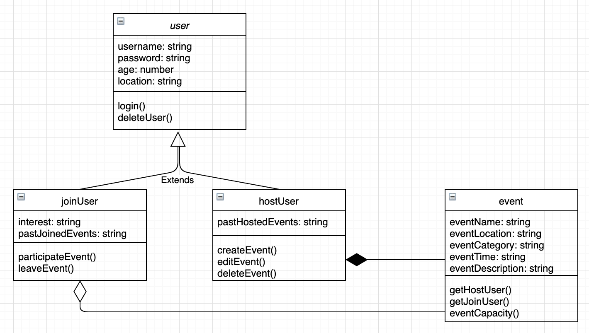

# Come2Gether

##Præsentation af system
Come2Gether er et administrativt system, hvis formål er at formidle social aktiviteter for ubekendte mennesker i forskellige byer, med det formål at skabe nye sociale relationer. Dette vil især være relevant for mennesker, som netop er flyttet et nyt sted hen, og skal til at etablere sig en ny omgangskreds. For at bruge systemet, skal man enten oprette en joinUser eller hostUser. Som joinUser vil man have mulighed for at deltage i events, som er lokalitets-, aktivitets- og tidsbestemte. Som hostUser vil man have mulighed for at oprette førnævnte events. Vi forestiller os, at et event i Come2Gether systemet kunne se således ud: 

> *København: Mad: fællesspisning fredag d. 13/9 kl. 19:00. 4 tilmeldte 2 pladser tilbage*

I systemet vil det være muligt at inddele de forskellige events i kategorier såsom sport, mad, kultur mm., med yderligere beskrivelser. Derved kan joinUsers browse gennem de forskellige events efter kategori og lokation.    

##Design af system

####Klassediagram

##Kravspecifikation

- hostUser
- event
- mm.