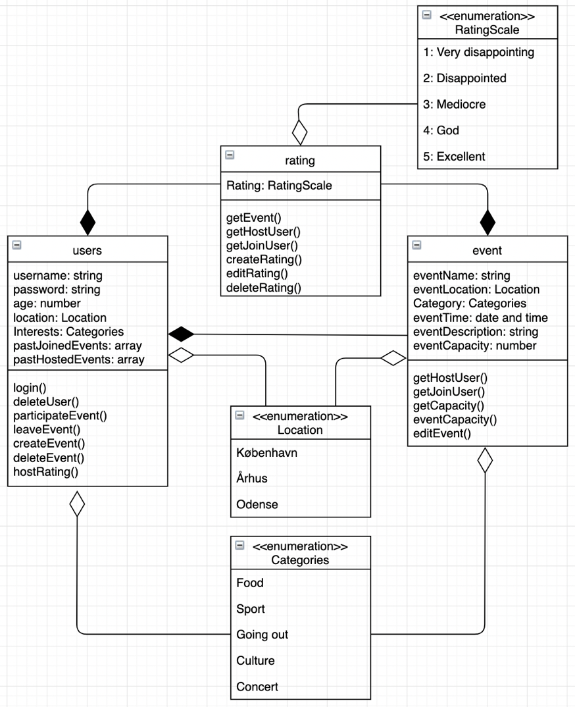
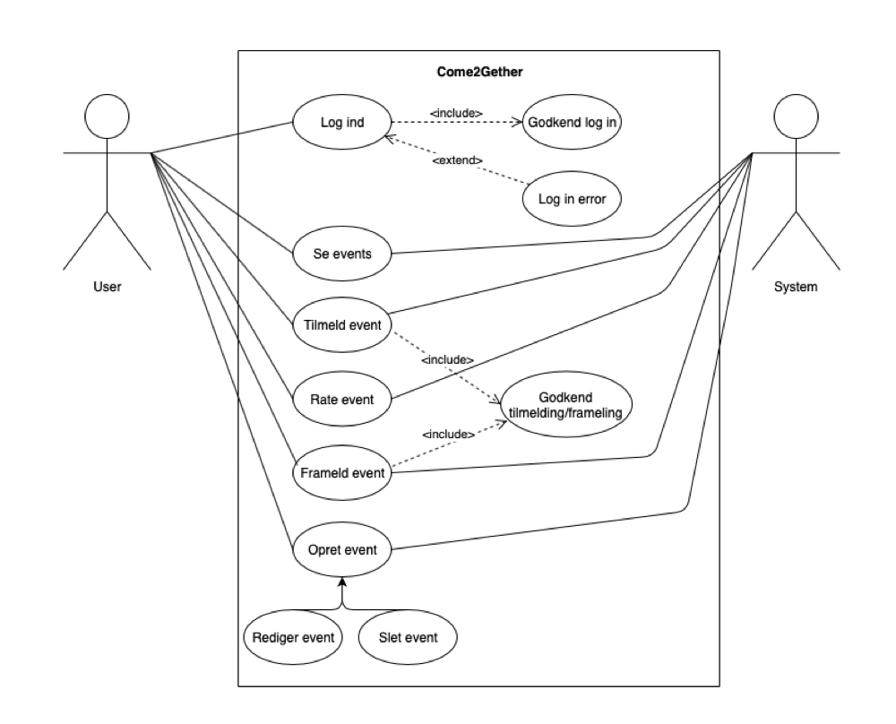

# Come2Gether

## Præsentation af system
Come2gether er et administrativt system, der skal formidle social aktiviteter for ubekendte mennesker i forskellige byer, med det formål at skabe nye sociale relationer.
For at bruge systemet, skal man oprette en user. Som user vil man have mulighed for at deltage i events, som er lokalitets-, aktivitets-, kapacitets- og tidsbestemte. Som user vil man også have mulighed for at oprette førnævnte events. 
I systemet vil det være muligt at inddele de forskellige events i forskellige kategorier såsom sport, mad, kultur mm., med yderligere unikke beskrivelser hvor værten beskriver eventet. Derved kan users browse gennem de forskellige events efter interesser og lokation, samt tilmelde sig ønskede events, hvor kapaciteten endnu ikke er fyldt. Efter hver endt event vil deltagende users kunne vurdere deres oplevelse med en rating (fra 1 til 5). Denne rating vil så blive tilknyttet event’et og værten. Dette gøres så users kan se hvilken rating hosten for et event har. Derigennem kan man få en god idé af hvad kvaliteten af eventet er. Denne funktionalitet skal hjælpe vores users med at undgå useriøse og ikke gennemførte events.

## Refleksion over ændringer
Vi har valgt at fjerne nedarvningerne (hostUser og joinUser) af user klassen, til fordel for én primær klasse, kaldet user. Dette er gjort af flere grunde, først og fremmest, da vi ønsker at så mange brugere som muligt opretter events. Ved at man skulle til at oprette en ny, anden type user, før det er muligt at arrangere et event, frygtede vi, at det kunne agere stopklods for tilførslen af nye events, hvorfor vi har valgt at samle funktionaliteten i én bruger, nemlig user.
Dernæst har én user-klasse, kontra to gjort vores arbejde nemmere og mere strømlinet. Ved kun at skulle forholde os til en type af user, har vi kunne forsimple vores kode drastisk, sammenlignet med da vi havde to typer, med hver deres sæt af funktionaliteter. Vi sad tilbage med følelsen af, at vi udviklede to separate systemer, som skulle kunne tale sammen, med hver deres funktionalitet. Derfor føler vi også nu, at vi med en mere strømlinet kode, har mulighed for at introducere et nyt tiltag, nemlig rating.

Med rating-klassen skal det være muligt for brugere at vurdere det event de var til, efter det er overstået. Denne rating består af en skala fra 1-5. Den samlede rating, altså gennemsnittet, bliver så tilknyttet både selve event’et og lagt til vært-brugerens samlede rating. Når en vært-bruger vil arrangere nye events i fremtiden, vil vært-brugerens rating, baseret på dennes tidligere arrangerede events, fremgå.
Derudover vil det være muligt at tilgå tidligere afholdte events, og se deres dertilhørende rating.

Vi har valgt at fjerne vores adresse-klasse, og skifte den ud med en enumeration (et prædefineret array af muligheder) som hedder location. Her har vi valgt nogle prædefinerede byer, som events kan ligge i. Dog er det muligt at specificere en præcis adresse i den givne by. På et senere tidspunkt vil vi gerne implementere en mulighed for, at illustrere lokationen af forskellige events på et kort, ved hjælp af Google Maps.
Derudover skal brugere ikke længere oplyse en lokation ved oprettelse af deres user, men har i stedet muligheden for at filtrere events efter de forskellige byer, som systemet agerer i. 
Vi har derudover gjort brug af en enumeration, til de kategorier som events kan ligge indenfor, samt de interesser (samme enumeration) som brugere kan have. Dette er til for, at give brugere muligheden for at filtrere i events efter kategori, og foreslå events til brugere, baseret på deres forudindtastede interesse.

Slutteligt har vi siden sidst gjort brug af localStorage, for at gøre det muligt for brugere at oprette deres egne users og deres egne events, således at brugere der tester systemet, ikke kun skal gøre brug af hard-codede users og events, men også deres egne.

## Kravspecifikation
### Aktører:
- user
- event
- rating

### Kravspecifikationer inddelt efter aktører:
user:
-	Skal kunne oprette sig som user
-	Skal kunne indtaste alder
-	Skal kunne slette egen bruger
-	Skal kunne logge på og se oversigt over alle events (både forrige og fremtidige)
-	Skal kunne tilføje interesser og filtrere events derefter
-	Skal kunne filtrere efter lokation (byer)
-	Skal kunne tilmelde sig event 
-	Skal kunne framelde sig event 
-	Skal kunne oprette egne events og inddele dem i interesser, lokation, tid, mm.
-	Skal kunne ændre i egne events
-	Skal kunne slette egne events
-	Skal kunne se tidligere events med dertilhørende rating
-	Skal kunne se andre værters rating på deres kommende events

event:
-	Skal kunne se deltagende users
-	Skal kunne lukke for tilmeldinger, når kapacitet er nået
-	Skal kunne definere navn, lokation, kategori, tidspunkt, kapacitet og beskrivelse. 
-	Skal kunne præsenteres og filtreres for den enkelte user  

rating:
-	Skal kunne bruges af user, som har været til et event, efter det er endt 
-	Skal kunne beregne gennemsnittet af ratings
-	Skal kunne beregne en samlet rating baseret på alle tidligere events for en unik vært 

### Klassediagram

### Usecasediagram
